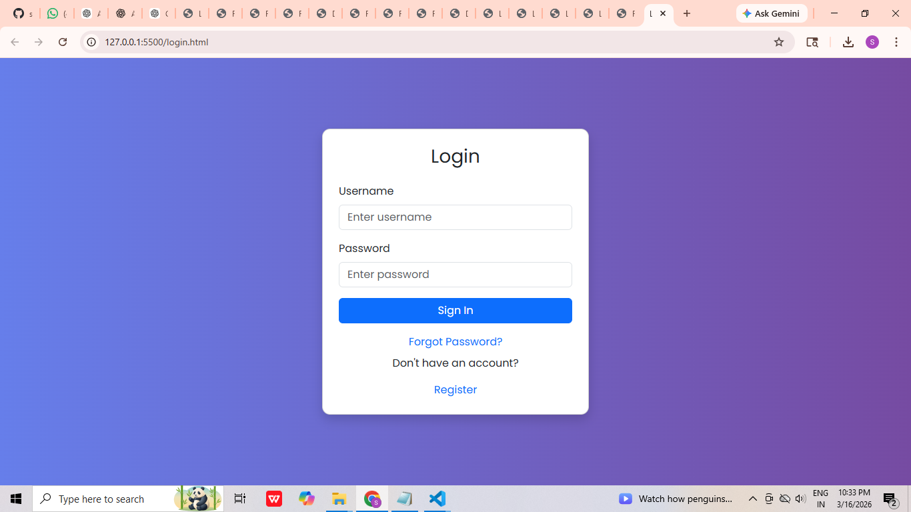
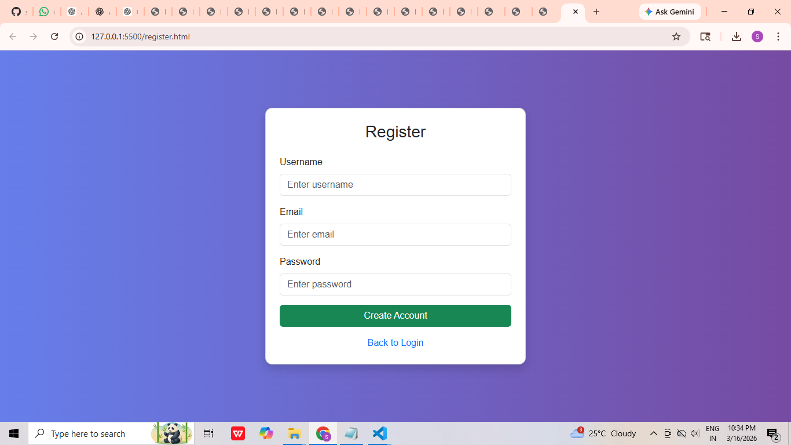
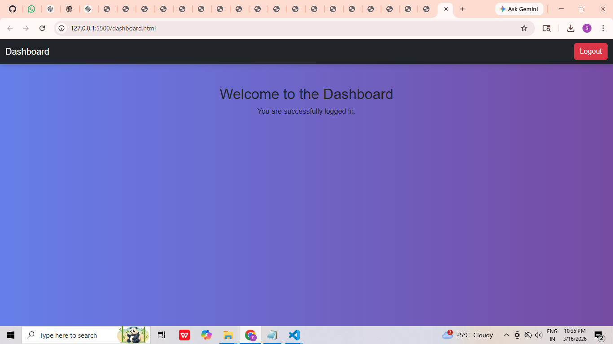

# Authentication System UI

This project is a simple **Authentication System Interface** developed using **HTML, CSS, and Bootstrap 5**.
It demonstrates how authentication pages in a web application are structured and styled using responsive design.

The project includes multiple pages that simulate a typical login workflow used in many modern web applications.

---

# Project Pages

The application contains the following pages:

* Login Page
* Registration Page
* Forgot Password Page
* Reset Password Page
* Dashboard Page

Each page is designed with a clean interface using **Bootstrap components and custom CSS styling**.

---

# Technologies Used

The project was developed using the following technologies:

* HTML5
* CSS3
* Bootstrap 5

Bootstrap helps create responsive layouts and provides ready-to-use components such as forms, buttons, and navigation elements.

---

# Project Structure

```
assignment2
│
├── login.html
├── register.html
├── forgot-password.html
├── reset-password.html
├── dashboard.html
├── style.css
├── README.md
│
└── screenshots
    ├── login.png
    ├── register.png
    ├── forgot-password.png
    ├── reset-password.png
    └── dashboard.png
```

---

# Screenshots

## Login Page



---

## Register Page



---

## Forgot Password Page


---

## Reset Password Page


---

## Dashboard Page



---

# Application Flow

1. Users enter their credentials on the **Login Page**.
2. If the user does not have an account, they can navigate to the **Register Page**.
3. If the password is forgotten, the user can access the **Forgot Password Page**.
4. The user can update the password on the **Reset Password Page**.
5. After logging in successfully, the user is redirected to the **Dashboard Page**.

---

# Purpose of the Project

This project was created as part of a **Frontend Development Assignment** to demonstrate:

* Multi-page authentication UI design
* Bootstrap integration
* Responsive web page layout
* Basic navigation flow between pages

---

# Author

Frontend Assignment
Full Stack Java Development Program
